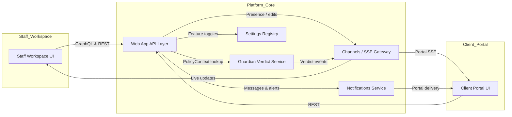

______________________________________________________________________

## Document Controls

<!-- BEGIN AUTO-GENERATED: document-controls -->
| Field | Value |
| --- | --- |
| Authors | Application Experience Working Group |
| Version | 0.1-draft |
| Status | implementable |
| Classification | Confidential |
| Last updated | 2025-10-29 |
| Updated by | Documentation Team |
| Owners | Platform Engineering; Product Management |
| Reviewers | Accessibility Program Lead; Operations Engineering |
| Approvers | Architecture Steering Committee; Security Review Board |
| Approved by |  |
| Approved date |  |
<!-- END AUTO-GENERATED: document-controls -->

**Status:** KEP: Provisional → Implementable → Implemented

______________________________________________________________________

## Reading Guide

- **Scope:** Describes the staff-facing workspace, reviewer consoles, and the client portal. Covers accessibility, collaboration, security posture, manual/agent edit tooling, conversational assistants, and document assembly flows.
- **Structure:** Sections follow the standard 0–10 service template. Responsibilities (§2) map to the major UI pillars; APIs (§3) reference capability discovery, SSE topics, and secure download flows; state, failure, observability, and compliance requirements are consolidated in §§4–7.
- **Maintenance:** Run `python -m doc_tools.manage_docs --lint docs/experience/web-app.md docs/overview/tdd.md docs/tdd_modularization.md` before submitting UI changes. Accessibility or localization updates must retain Appendix references and regenerate Vale/axe snapshots where noted.
- **Change protocol:** UX-affecting PRs update this spec and cite ADR-0002 when API contracts change. Security posture updates (headers, invalidation flows, break-glass) require Security + Architecture approval.
- **References:** TDD §11 summary, Guardian spec §5, Communications spec §2.6, Settings Registry §5 (UI policy keys), Ops runbooks `RB-PORTAL-INVALIDATION` and `RB-JOB-WATCHDOG`.
- **Contacts:** Platform Engineering (frontend owners), Product Management (experience roadmap), Accessibility guild, `#web-app` Slack channel, on-call rotation `webapp-oncall@`.

______________________________________________________________________

## 1) Purpose

**Purpose:** Deliver compliant, accessible, real-time experiences for staff and clients to review, approve, and receive platform artifacts. **|**
**Contract:** The web app must respect policy masks, Guardian verdicts, residency controls, and rate limits while providing deterministic state transitions and audit trails. **|**
**State:** UI derives state from case-scoped timelines, artifact manifests, Guardian history, outbox receipts, and Settings-driven feature toggles. **|**
**Failures & handling:** SSE disconnects, stale tokens, portal invalidations, or edit workflow violations surface actionable messaging, link to runbooks, and avoid silent failure. **|**
**Observability:** Grafana dashboards (“Operator Workspace”, “Portal Integrity”, “Notifications Delivery”, “Assistant Usage”) plus synthetic monitors and axe snapshots track health. **|**
**Breadcrumbs:** Frontend views `apps/platform/ui/views/*.py`, portal controllers `apps/platform/portal/*.py`, component library `packages/udocket_ui/*`, integration tests `tests/platform/ui/*.py`, Playwright suites `tests/e2e/ui/*.py`. **|**
**References:** §2 Responsibilities, §4 State management, §5 Failure modes, §7 Security & compliance.

______________________________________________________________________

## 2) Responsibilities

**Purpose:** Enumerate functional responsibilities and non-goals. **|**
**Contract:** Spell out mandatory behaviours, idempotency, regulatory duties. **|**
**State:** Describe ownership of state transitions or data stewardship. **|**
**Failures & handling:** Identify responsibility gaps and escalation paths. **|**
**Observability:** Checks proving each responsibility works. **|**
**Breadcrumbs:** Implementation/tests supporting each responsibility. **|**
**References:** Service/TDD sections that expand on responsibilities.

### 2.1 Staff operator workspace & approvals (binding)

**Purpose:** Provide case-centered tooling for operators and reviewers with deterministic status reporting. **|**
**Contract:** Case workspace renders artifact timelines, job state, approvals, Guardian outcomes, and analytics without exposing masked data. SSE/Channels feeds must stay case-scoped and honor RLS. **|**
**State:** Case dashboards pull from `case_secure`, `artifact_secure`, job manifests, Guardian verdicts, and FinOps metrics. **|**
**Failures & handling:** SSE disconnects fall back to polling with visible banners; missing Guardian verdicts lock approval actions pending remediation per `RB-JOB-WATCHDOG`. **|**
**Observability:** Metric panels `operator_break_glass_requested_total`, `review_queue_backlog_total`, `job_watchdog_warning_total`; synthetic monitors validate SSE and approval flows. **|**
**Breadcrumbs:** Operator view `apps/platform/ui/views/operator_workspace.py`, approval components `packages/udocket_ui/approvals/*`, SSE publisher `apps/platform/events/jobs.py`, tests `tests/platform/ui/test_operator_workspace.py`, `tests/platform/ui/test_review_approvals.py`, `tests/e2e/test_job_status_widget.py`. **|**
**References:** Communications spec §2.6 (in-app alerts), Guardian spec §5 (verdict integration).

- Approvals panel enforces multi-step review with optimistic concurrency; UI surfaces reviewer counts, Guardian reason codes, backlog age warnings, and links to runbooks.
- Job tiles display watchdog warnings with tooltips summarizing latest heartbeat, lane, and remediation guidance.
- Analytics widgets expose LLM spend, artifact coverage, and QA issues, sourcing data from audit logs and FinOps metrics.
- Live status widget follows the accessible SSE pattern in Appendix A.2: `aria-live="polite"`, deterministic status badges (`data-status` mapped to design tokens), token-bound credentials, and retry backoff through shared `useConnectivity`.
- SSE stream delivers `job.accepted`, `job.running`, `job.update`, `job.blocked`, `job.completed`, `job.failed`, and `job.canceled` events; each payload carries `schema_version`, `emitted_at`, Guardian verdict snapshots, and `provider_progress` so operators can reconcile status without polling.

### 2.2 Client portal (binding)

**Purpose:** Deliver masked, policy-compliant artifacts and messaging to clients with audit-friendly controls. **|**
**Contract:** Portal enforces org membership, masking, entitlement scopes, and download token validation; invalidations reflect instantly via SSE. **|**
**State:** Portal views consume `artifact_secure`, `delivery_receipt_secure`, entitlements, Guardian history, and notification digests. **|**
**Failures & handling:** Invalid or expired tokens return 403/410 with denial banners; policy violations trigger quarantine messaging and block downloads. **|**
**Observability:** Grafana “Portal Integrity” (`portal_link_invalidated_total`), “Abuse Signals” (`PORTAL_PHISHING_REPORT`), synthetic download tests. **|**
**Breadcrumbs:** Portal controllers `apps/platform/portal/*.py`, download guard `apps/platform/portal/downloads.py`, tests `tests/platform/portal/test_portal_invalidation.py`, notifications spec §2.4. **|**
**References:** Communications spec (download tokens), Settings Registry §5.2 (portal toggles).

- Staff-triggered invalidations emit SSE `portal.link_invalidated`, revoke tokens, and present denial banners.
- Phishing reports log audit `PORTAL_PHISHING_REPORT` and feed abuse dashboards.
- Portal messaging integrates secure threads (§2.6) and applies retention aligned with case lifecycle.
- Threads are restricted to case participants; RLS policies ensure staff cannot view client-only conversations from other cases.
- Attachments are uploaded as `ATTACHMENT_RAW`/`ATTACHMENT_TEXT` artifacts, run through Guardian/Notifications review, and inherit download-token enforcement when exposed in the portal.
- Download guard (`apps/platform/portal/downloads.py::enforce_if_match`) verifies `If-Match` headers, signed token hash, artifact status, and residency metadata before streaming; replays or revoked links return `403` with audit `PORTAL_DOWNLOAD_PRECONDITION`.
- All portal queries rely on secure views (`artifact_secure`, `delivery_receipt_secure`) so masked fields never bypass Guardian policies.
- Org Admin usage dashboard (`portal.usage_dashboard.enabled`) mirrors staff FinOps metrics (`llm_cost_estimate_total`, `finops_cost_per_case_usd`, `case_jobs_total`) with secure-view scoping; CSV exports respect rate limits and localization constraints.
- Usage transparency launches only after localization review, support playbooks, and synthetic parity checks with staff dashboards. Anomalies raise `PORTAL_USAGE_EXPORT_ANOMALY` and disable the feature flag until resolved.

### 2.3 Accessibility & localization (binding)

**Purpose:** Meet WCAG 2.2 AA requirements and deliver localized experiences across staff and portal surfaces. **|**
**Contract:** UI components honor semantic markup, keyboard navigation, focus management, and contrast budgets; localization keys originate from LP Engine bundles and pseudolocale checks block regressions. **|**
**State:** Localization assets live in Settings (`i18n.*`) and LP Engine bundles; accessibility evidence stored in Ops appendices. **|**
**Failures & handling:** Missing translations or accessibility regressions trigger runbook `RB-LPE-LOCALE-GAP` and block releases until evidence restored. **|**
**Observability:** Nightly axe snapshots, Playwright RTL runs, localization audit scripts (`ops/scripts/lpe/audit_locales.py`). **|**
**Breadcrumbs:** Component library `packages/udocket_ui/`, localization pipeline `packages/udocket_core/lpe/*`, tests `tests/e2e/test_accessibility.py`. **|**
**References:** LP Engine spec §2, Ops runbook index (LPE locale gap).

- Pseudolocale builds run pre-merge; Vale lint enforces accessibility wording.
- `aria-live`, focus trapping, and keyboard outreach patterns follow Appendix A.2 guidelines; components failing contrast budgets require design review.
- Nightly axe/Playwright suites capture snapshots for core flows (staff approvals, portal delivery, chat assistant); regressions block deploy until evidence restored in ops appendices.
- Localization activation refuses enabling a locale unless LP Engine bundles include translations and QA recordings with sign-off artifacts attached.

### 2.4 Real-time collaboration & presence (binding)

**Purpose:** Enable shared editing, presence indicators, and live updates without cross-case leakage. **|**
**Contract:** SSE and Channels sessions bind to case/org scopes, enforce SameSite cookies, and respect rate limits; optimistic updates reconcile with server events safely. **|**
**State:** Presence metadata stored in Redis; session context derived from case membership and settings toggles. **|**
**Failures & handling:** Connection drops raise UI banners and trigger exponential backoff; session mismatches force re-auth. **|**
**Observability:** Metrics `sse_connection_drop_total`, synthetic monitors for SSE schema version drift, audit `CHANNEL_SESSION_STARTED/ENDED`. **|**
**Breadcrumbs:** Channels configuration `apps/platform/ui/channels.py`, presence service `apps/platform/ui/presence.py`, SSE publishers `apps/platform/events/*.py`, tests `tests/e2e/test_collaboration.py`, `tests/platform/ui/test_presence_indicator.py`. **|**
**References:** Communications spec §2.6 (in-app notifications), Guardian spec (quarantine broadcasts).

### 2.5 Security posture & hardening (binding)

**Purpose:** Enforce secure defaults for headers, anti-phishing, download guards, and MFA/step-up workflows. **|**
**Contract:** Web and portal responses include CSP, HSTS, frameguard, referrer, and permissions policy headers; anti-phishing tooling logs and escalates suspicious activity. **|**
**State:** Header templates, download guard policies, phishing audit logs. **|**
**Failures & handling:** Header regressions fail CI; phishing detections raise alerts and prompt incident templates. **|**
**Observability:** Grafana “Frontend CSP”, `portal_412_precondition_total`, audit `PORTAL_DOWNLOAD_PRECONDITION`. **|**
**Breadcrumbs:** Security middleware `apps/platform/ui/security/csp.py`, download guard `apps/platform/portal/downloads.py`, phishing logger `apps/platform/notifications/phishing.py`, tests `tests/ui/test_csp_nonced.py`, `tests/platform/notifications/test_phishing_workflow.py`. **|**
**References:** Communications spec (download tokens), Settings Registry (MFA/step-up toggles).

### 2.6 Secure portal messaging (binding)

**Purpose:** Offer case-scoped, RLS-enforced messaging with Guardian oversight. **|**
**Contract:** Messaging threads store artifacts (`ATTACHMENT_*`), enforce opt-in rate limits, and rely on signed URLs from the notifications service. **|**
**State:** Tables `message_thread`, `message`, `message_attachment`, `message_read_receipt`; attachments reference artifact IDs. **|**
**Failures & handling:** Abuse detection triggers alerts and throttles; retention aligns with case lifecycle. **|**
**Observability:** Metrics `message_delivery_total`, anomaly detectors on abuse signals, SSE updates for read receipts. **|**
**Breadcrumbs:** Messaging controllers `apps/platform/portal/messaging.py`, notifications spec §2.6, tests `tests/platform/portal/test_secure_messaging.py`. **|**
**References:** Communications spec (tokens & in-app alerts), Guardian spec §5.

### 2.7 Manual and agent edit workflows (binding)

**Purpose:** Manage dual approval, provenance, and moderation for manual and AI-assisted edits. **|**
**Contract:** Manual edits produce child artifacts linked to parents; agent edits capture prompts, model settings, and moderation results. Dual approval enforces distinct reviewers via OCC and unique indices. **|**
**State:** Edit manifests track `{edit_type, editor_id, diff_fingerprint_sha256, model_id?, prompt_id?, moderation_outcome}` with logs in `ops/<job_id>__edit_log.jsonl`. **|**
**Failures & handling:** Policy violations (`EDIT_POLICY_BLOCK`) quarantine artifacts; repeated rejects page engineering. **|**
**Observability:** Metrics `edit_sessions_total{type}`, `edit_policy_block_total`, SSE events `edit.started|edit.updated|edit.ready_for_review`. **|**
**Breadcrumbs:** Edit controllers `apps/platform/ui/views/edit_flow.py`, LangGraph edit lanes `packages/udocket_core/agents/edit/*`, tests `tests/platform/ui/test_edit_workflow.py`. **|**
**References:** Guardian spec §5, LLM registry spec §2.3 (safety harness).

- SSE events inform collaborators of edit lifecycle stages, and Communications service issues actionable toasts/email when reviewer attention is required.
- Database partial unique index (`approve_once_per_user ON artifact_review ...`) enforces distinct approvers; UI surfaces inline conflicts when reviewers attempt duplicate approvals.
- Manual edits collect operator change summaries and diff previews; agent edits store prompts, models, moderation outcomes, and diff fingerprints so reviewers can audit provenance.
- Guardian moderation integrates with the edit UI so policy-blocked runs render banners alongside remediation guidance and links to `RB-JOB-WATCHDOG` when manual intervention required.

### 2.8 Document assembly pipeline (binding)

**Purpose:** Convert Compose outputs into deliverable-ready documents with signing prerequisites. **|**
**Contract:** Pipeline renders DOCX/PDF artifacts, lints placeholders, computes hashes, and enforces exclusive approvals; integrates with Digital Signer before portal release. **|**
**State:** `ASSEMBLED_DOC_*` artifacts progress `PROCESSING → PENDING_JUDGMENT → OPERATOR_PREP → APPROVAL_REQUESTED → QUEUED_FOR_REVIEW → APPROVED`; manifests capture template version and hash. **|**
**Failures & handling:** Lint errors surface warnings; pipeline halts until resolved; signing blockers escalate per Signer spec. **|**
**Observability:** Metrics `document_assembly_duration_seconds`, `document_assembly_error_total`; logs include lint warnings. **|**
**Breadcrumbs:** Assembly job `apps/platform/operations/task_modules/compose.py::assemble_documents`, signer spec §2, tests `tests/platform/operations/test_document_assembly.py`. **|**
**References:** Compose agent spec (future), Digital Signer spec §2.1.

### 2.9 Conversational assistants UX (binding)

**Purpose:** Deliver scoped AI assistants for staff and clients with auditability and policy enforcement. **|**
**Contract:** Assistants run LangGraph pipelines with retrieval restricted to authorized artifacts; sessions log manifests, Guardian verdicts, and moderation outcomes. Client assistant includes informational disclaimers. **|**
**State:** Chat sessions stored under `storage/media/tenants/<ORG_ID>/cases/<case>/ops/<session_id>__chat_{audience}.jsonl`; manifests record `{model_id, prompt_version, retrieval_sources[], token_usage, latency_ms}`. **|**
**Failures & handling:** Policy violations (`CHAT_POLICY_BLOCK`, `CHAT_GUARDIAN_QUARANTINED`) disable access pending review; rate-limit exhaustion surfaces UI banners. **|**
**Observability:** Metrics `chat_sessions_total{audience}`, `chat_token_usage_total`, `chat_rate_limit_block_total`, dashboards “Assistant Usage” and “Assistant API”. **|**
**Breadcrumbs:** Assistant orchestrator `apps/platform/ui/assistants.py`, LangGraph pipelines `packages/udocket_core/agents/assistants/*`, tests `tests/e2e/test_chat_assistant.py`, API spec `ops/openapi/chat_assistants.yaml`. **|**
**References:** TDD §10.12 (capability APIs), LLM registry spec §2.3 (moderation), Communications spec §2.6 (alerting).

- Staff Copilot sessions access approved artifacts, Guardian manifests, Settings snapshots, and portal messages with redaction. Outputs include citations and never mutate artifacts directly.
- Client portal guide constrains retrieval to approved deliverables and knowledge flagged `portal_visible=true`; policy violations return localized disclaimers.
- Rate limits derive from Settings `chat.staff.*` / `chat.client.*`; concurrency caps enforce `chat.session.max_active_per_user`.
- Moderation filters run pre-/post-call; Guardian escalations disable assistants automatically when severity ≥ high.
- Assistant manifests include `disclaimer_version`, `policy_context_digest`, and `guardian_session_verdict_id` so auditors can reconcile UI prompts and moderation outcomes with the stored evidence.
- UI surfaces rate-limit banners (`chat.sessions.limit`) and localized policy blocks when assistants decline to answer.

______________________________________________________________________

## 3) API Contract

**Purpose:** Outline the interfaces powering the web app and portal experiences. **|**
**Contract:** REST endpoints require OAuth scopes (`org_operator`, `org_client`), enforce optimistic concurrency, and honor RLS context. SSE/Channels topics remain case/org scoped and versioned. **|**
**State:** APIs interact with views `*_secure`, outbox/download token tables, messaging threads, edit manifests, and chat session evidence. **|**
**Failures & handling:** Missing tokens, stale ETags, or scope violations return typed errors (`401`, `403`, `409`) with audit trails. **|**
**Observability:** API metrics `portal_request_total`, `review_action_total`, `chat_assistant_metadata_requests_total`; SSE schema changes trigger synthetic monitors. **|**
**Breadcrumbs:** REST controllers `apps/platform/api/*.py`, SSE publishers `apps/platform/events/*.py`, OpenAPI specs `ops/openapi/uDocket-platform.openapi.yaml`, `ops/openapi/chat_assistants.yaml`. **|**
**References:** Communications spec (download/token APIs), Guardian spec (approval endpoints), ADR-0002 (versioning policy).

### 3.1 External Interfaces

Portal downloads exchange signed tokens issued by the Communications service; `If-Match` and download guard logic enforce conditional requests and provenance hashes. Chat capability endpoints (`/api/v1/chat/assistants`) publish assistant metadata, rate limits, disclaimers, and availability windows with ETag support. Real-time updates stream via SSE and Channels namespaces (`case.{id}.timeline`, `case.{id}.edits`, `notifications.case.{id}`, `chat.assistant.updated`, `portals.{case_id}`) scoped to the caller’s organisation and case.

### 3.2 Internal Interfaces

The UI coordinates with internal controllers for portal messaging, edit manifests, and assistant orchestration. SSE publishers in `apps/platform/events/*.py` broadcast state transitions to the front-end, while background jobs in the worker cluster hydrate downloads, regenerate manifests, and backfill presence events. Layout builders in `apps/platform/ui/views/*.py` assemble React component payloads from secure views (`*_secure`) governed by the Settings registry.

### 3.3 API Error Codes (binding) {#3-3-api-error-codes-binding}

**Purpose:** Document the `ApiError.code` values that the web application surfaces so UX flows handle retries and blocking states consistently. **|**
**Contract:** Staff and portal clients reuse the platform catalog in [`Platform Runtime §3.3`](../platform/runtime.md#33-api-error-codes); the UI introduces the cases below for assistant and portal interactions. **|**
**State:** Codes originate from REST responses (`/api/v1/chat/*`, `/api/v1/portal/*`) and SSE events; enum definitions live alongside the platform schema (`spec/schemas/api_error.schema.json`) with UI adapters in `apps/platform/ui/errors.py`. **|**
**Failures & handling:** Unknown codes fail UI Spectral lint and unit tests; runtime emissions trigger `ui_api_error_unknown_total` alerts. **|**
**Observability:** Dashboards “Web App – API Errors” and “Portal Integrity” watch `ui_api_error_total{code}`; synthetic probes cover chat availability and portal download flows. **|**
**Breadcrumbs:** Controllers `apps/platform/api/chat.py`, portal download guard `apps/platform/portal/downloads.py`, UI error mappers `apps/platform/ui/errors.py`, tests `tests/platform/ui/test_error_adapters.py`, `tests/platform/portal/test_portal_errors.py`. **|**
**References:** Platform Runtime §3.3, Communications spec §2.4 (download tokens), Settings spec §11.11 (assistant toggles), TDD §10.12.
> _Full listing:_ [API error codes index](../overview/tdd/appendices/api_error_codes.md#web-application-portal)

<!-- BEGIN AUTO-GENERATED: api-error-codes:summary (error_codes.yaml) -->
| Code | Scenario | Client guidance |
| --- | --- | --- |
| `CHAT_DISABLED` | Org-level settings or Guardian policy disabled assistants for the active org or case. | Display the assistant-disabled banner, suppress retries, direct operators to review Settings or Guardian waivers. |
| `POLICY_BLOCK` | Guardian or residency guard blocked an action invoked from the UI. | Surface Guardian reason/details, require operator remediation before enabling another attempt. |
| `PORTAL_DOWNLOAD_PRECONDITION` | Portal download request failed the If-Match guard or token validation. | Prompt the client to refresh the deliverable list, regenerate the download link, and avoid automatic retry loops. |
| `RATE_LIMIT` | Client exceeded the configured RPM or token limits for chat or portal download APIs. | Honor Retry-After headers, show throttling guidance, and back off additional attempts. |
<!-- END AUTO-GENERATED: api-error-codes:summary (error_codes.yaml) -->

<!-- BEGIN AUTO-GENERATED: api-error-codes:catalog (error_codes.yaml) -->
| Code | HTTP Status | Audit Required | Metrics |
| --- | --- | --- | --- |
| `CHAT_DISABLED` | 403 | No | ui_api_error_total |
| `POLICY_BLOCK` | 403 | Yes | ui_api_error_total |
| `PORTAL_DOWNLOAD_PRECONDITION` | 412 | No | portal_download_error_total |
| `RATE_LIMIT` | 429 | No | ui_api_error_total<br>ui_rate_limit_total |
<!-- END AUTO-GENERATED: api-error-codes:catalog (error_codes.yaml) -->

### 3.4 Interaction Topology (informative)

**Purpose:** Visualise how staff and portal surfaces collaborate with backend services in real time. **|**
**Contract:** Staff and client flows rely on API, Channels, Guardian, Settings, and Notifications integrations depicted below; changes must preserve these linkages. **|**
**State:** Diagram source `experience/web-app/diagrams/ui-interaction-topology-v1.mmd` renders to build artifacts for docs/site and PDFs. **|**
**Failures & handling:** Drift between diagram and implementation is treated as documentation debt and must be reconciled during UI changes. **|**
**Observability:** Docs CI (`python -m doc_tools.render_mermaid`) renders SVG artifacts and alerts when sources are missing. **|**
**Breadcrumbs:** API controllers `apps/platform/api/*.py`, Channels gateway `apps/platform/ui/channels.py`, Notifications integration `apps/platform/notifications/*`, Guardian verdict publisher `apps/platform/events/guardian.py`. **|**
**References:** Guardian spec §2, Communications spec §2, Settings spec §3.



<figure class="full-width-diagram">
  
  <figcaption style="font-size: 0.9em; color: #555;">Web app staff and portal interaction topology</figcaption>
</figure>

______________________________________________________________________

## 4) State Management

**Purpose:** Explain persistent stores and configuration artifacts backing the UI. **|**
**Contract:** Secure views, manifests, and token stores must enforce RLS, masking, and reproducibility; Settings snapshots remain authoritative. **|**
**State:** `case_secure`, `artifact_secure`, `delivery_receipt_secure`, messaging tables, edit manifests, download tokens, chat envelopes, localization bundles. **|**
**Failures & handling:** RLS drift or stale manifests block releases until Settings rollback; token corruption triggers revocation and regeneration. **|**
**Observability:** Metrics `portal_link_invalidated_total`, audit streams (`EDIT_EVENT`, `DOWNLOAD_TOKEN_*`), ops logs per case. **|**
**Breadcrumbs:** Secure view migrations `db/migrations/security/*.sql`, messaging models `apps/platform/portal/messaging.py`, token store `apps/platform/notifications/download_tokens.py`, edit manifests `apps/platform/ui/views/edit_flow.py`. **|**
**References:** Communications spec §4, Guardian spec §4, Settings Registry §5.2.

- Secure views (`case_secure`, `artifact_secure`, `delivery_receipt_secure`, `message_thread_secure`) provide masked data to the UI; base tables remain inaccessible to the application role.
- Messaging and edit manifests capture provenance and feed Guardian/QA automation; artifacts link to versions and approvals for deterministic swap logic.
- Download tokens persist hashes, issuer, expiry, and redemption metadata; single-use enforcement lives in Communications service.
- Chat session envelopes archive manifests and redacted transcripts under case ops directories; HIPAA mode stores hashes only.
- Localization bundles sourced from LP Engine (`i18n.*`); pseudolocale and regression evidence stored in ops appendices.

______________________________________________________________________

## 5) Failure Modes

**Purpose:** Highlight primary failure scenarios and expected remediation paths. **|**
**Contract:** UI must fail closed, surface actionable messaging, and avoid silent data exposure. **|**
**State:** Job status, portal tokens, edit manifests, assistant manifests, accessibility evidence. **|**
**Failures & handling:** SSE fallback, portal invalidation, policy blocks, moderation abuse, accessibility regression. **|**
**Observability:** Metrics `sse_connection_drop_total`, `portal_412_precondition_total`, `edit_policy_block_total`, `chat_policy_block_total`; audit events `PORTAL_DOWNLOAD_PRECONDITION`, `EDIT_POLICY_BLOCK`, `CHAT_POLICY_BLOCK`. **|**
**Breadcrumbs:** Runbooks `RB-JOB-WATCHDOG`, `RB-PORTAL-INVALIDATION`, `RB-CHAT-ABUSE`, `RB-LPE-LOCALE-GAP`. **|**
**References:** Communications spec, Guardian spec, Settings spec.

- **SSE disconnects:** UI shows offline banner, retries with exponential backoff; after repeated failure, fall back to polling and log `UI_SSE_FALLBACK`.
- **Portal invalidation:** Tokens revoked, requests return 403 with audit `PORTAL_DOWNLOAD_PRECONDITION`; UI presents denial banners and links to support.
- **Edit policy violations:** Agent edits blocked with `EDIT_POLICY_BLOCK`, Guardian quarantine triggered; reviewers notified via Communications service.
- **Chat abuse:** Moderation triggers `CHAT_POLICY_BLOCK`; assistants disabled until Security resolves; incidents documented in App.O.
- **Accessibility regressions:** CI/VALE failures block releases; runbook `RB-LPE-LOCALE-GAP` executed to restore coverage.

______________________________________________________________________

## 6) Observability

**Purpose:** Ensure the UI has adequate telemetry for health, performance, and policy compliance. **|**
**Contract:** Maintain dashboards, emit structured events, and run synthetics covering core journeys. **|**
**State:** Grafana dashboards, Prometheus metrics, structured logs, synthetic job artifacts. **|**
**Failures & handling:** Missing metrics or failing synthetic checks page SRE and block releases until remediation. **|**
**Observability:** Dashboards “Operator Workspace”, “Portal Integrity”, “Notifications Delivery”, “Assistant Usage”, “Accessibility & Localization”; metrics `review_queue_backlog_total`, `portal_link_invalidated_total`, `chat_sessions_total{audience}`, etc.; logs `UI_EVENT`, `PORTAL_EVENT`, `CHAT_SESSION`, `EDIT_EVENT`. **|**
**Breadcrumbs:** Dashboard configs `infra/observability/dashboards/*.json`, synthetic scripts `synthetics/*.yaml`, logging adapters `packages/udocket_core/logging/*`. **|**
**References:** Communications spec §6, LLM Registry spec §6, Settings spec §6.

- Dashboards: “Operator Workspace”, “Portal Integrity”, “Notifications Delivery”, “Assistant Usage”, “Accessibility & Localization”.
- Metrics: `review_queue_backlog_total`, `job_watchdog_warning_total`, `portal_link_invalidated_total`, `portal_phishing_report_total`, `inapp_notification_sent_total`, `chat_sessions_total{audience}`, `chat_policy_block_total`.
- Synthetic monitors: SSE schema validation, portal download smoke tests, chat latency & policy checks, axe accessibility scans.
- Logs: structured `UI_EVENT`, `PORTAL_EVENT`, `CHAT_SESSION`, `EDIT_EVENT` with correlation IDs and masked fields.

### 6.1 SLOs & Targets (binding)

**Purpose:** Capture availability, latency, notification, and assistant policy goals for the web experience. **|**
**Contract:** Portal uptime, latency, SSE reliability, and assistant guardrails must meet the thresholds below before releases ship. **|**
**State:** Metrics `portal_http_availability`, `portal_ttfb_seconds`, `ui_interaction_latency_seconds`, `sse_connection_drop_total`, `chat_policy_block_total`; dashboards “Portal Integrity”, “Operator Workspace”, “Notifications Delivery”, “Assistant Usage”. **|**
**Failures & handling:** Breaches invoke RB-PORTAL-AVAIL, RB-PORTAL-PERF, RB-NOTIFY-INAPP, or RB-ASSISTANT-GUARDRAIL prior to resuming deploys. **|**
**Observability:** Grafana dashboards, synthetic portal tests, SSE monitors, and assistant QA reports provide evidence. **|**
**Breadcrumbs:** Prometheus rules `infra/monitoring/web-app-prometheus-rules.yaml`, synthetics `synthetics/web_portal_*.yaml`, runbooks `docs/ops/runbooks/web-app/*.md`. **|**
**References:** Notifications §6, Guardian §7, Settings §6.

- **Portal availability:** ≥99.9% monthly uptime for authenticated views, measured via synthetic portal smoke tests and `portal_http_availability`. Breaches trigger RB-PORTAL-AVAIL and pause deploys.
- **Latency:** Portal TTFB P95 ≤ 400 ms for in-region clients (`portal_ttfb_seconds`), and staff workspace interactive latency (`ui_interaction_latency_seconds`) P95 ≤ 250 ms. Exceeding budgets invokes RB-PORTAL-PERF.
- **Notification fan-out:** SSE drop rate (`sse_connection_drop_total`) < 1% rolling 15 minutes; higher rates trigger RB-NOTIFY-INAPP before UI degradation spreads.
- **Assistant policy adherence:** Policy block rate (`chat_policy_block_total / chat_sessions_total`) stays below 5% while ensuring zero policy escapes; breaches trigger RB-ASSISTANT-GUARDRAIL review.

______________________________________________________________________

## 7) Security & Compliance

**Purpose:** Capture authentication, masking, and policy obligations for the web surfaces. **|**
**Contract:** Enforce hardened headers, signed download tokens, step-up MFA, masking, and audit trails; break-glass requires dual approval. **|**
**State:** CSP configs, download token records, phishing logs, break-glass artifacts, assistant manifests. **|**
**Failures & handling:** Header drift fails CI; phishing surges trigger incident templates; unauthorized access attempts blocked and logged. **|**
**Observability:** Metrics `portal_412_precondition_total`, `portal_phishing_report_total`, audit events `PORTAL_DOWNLOAD_PRECONDITION`, `TOKEN_REVEAL_REQUEST`, `CHAT_POLICY_BLOCK`. **|**
**Breadcrumbs:** Middleware `apps/platform/ui/security/csp.py`, download guard `apps/platform/portal/downloads.py`, phishing logger `apps/platform/notifications/phishing.py`, break-glass schema `spec/schemas/break_glass_event.schema.json`. **|**
**References:** Communications spec §7, Settings spec §7, Guardian spec §7.

- Enforce HSTS (min 1 year), CSP nonces, frameguard `DENY`, referrer policy `strict-origin-when-cross-origin`, permissions policy disabling camera/mic by default.
- Portal downloads require signed tokens and `If-Match` headers; replays denied even if token valid but entitlement revoked.
- Break-glass flows demand step-up MFA (WebAuthn) on activation and closure; events logged per `spec/schemas/break_glass_event.schema.json`.
- Manual/agent edits require audit provenance, dual approval for high-risk artifacts, and Guardian oversight.
- Conversational assistants require localized disclaimers, HIPAA gating, and moderation verdict logging.
- Accessibility and localization compliance captured in ops appendices for regulators; DSAR/erasure requests propagate to portal artifacts and chat transcripts.
- Middleware rejects spoofed headers (`X-Org-ID`, `X-Active-Roles`) and requires HMAC signatures for internal RPCs in addition to mTLS; authentication context derived exclusively from OIDC tokens.
- Phishing report workflow sanitizes URLs, rate-limits reporters, and routes incidents to Security with pre-filled App.O templates.

______________________________________________________________________

## 8) Operational Notes

**Purpose:** Keep the staff workspace and client portal operationally ready while satisfying security and compliance controls. **|**
**Contract:** Runbooks, drills, and release workflows must stay current; UI surfaces pause when alert gates or evidence requirements fail. **|**
**State:** Runbooks in `ops/runbooks/webapp/` and `ops/runbooks/notifications/`, drill evidence `ops/webapp/drills/<date>/`, freeze calendars `ops/webapp/freeze_windows.ics`. **|**
**Failures & handling:** Stale playbooks, missed drills, or expired freezes block deployments until remediation and evidence capture. **|**
**Observability:** Docs lint (`make docs.check.runbooks`), dashboards “Portal Integrity”/“Operator Workspace”, alert `portal_link_invalidated_total`. **|**
**Breadcrumbs:** Runbook index `docs/ops/runbooks.md`, drill scripts `ops/scripts/webapp/schedule_drills.py`, governance policies App.N. **|**
**References:** §5 Failure modes, §6 Observability, §7 Security & compliance.

### 8.1 Operational Posture (binding)

**Purpose:** Document on-call coverage, freeze windows, and readiness assumptions for the web application. **|**
**Contract:** Platform Engineering owns PagerDuty “WebApp SLO”, enforces release freezes during major UI migrations, and keeps portal/privacy SMEs on-call for high-severity incidents. **|**
**State:** Roster `ops/webapp/roster.yaml`, freeze calendar `ops/webapp/freeze_windows.ics`, contact matrix in App.N. **|**
**Failures & handling:** Unstaffed shifts or ignored freezes escalate to Product & Security; deployments halted until posture restored. **|**
**Observability:** PagerDuty metrics, freeze dashboards, alert `webapp_oncall_gap_total`. **|**
**Breadcrumbs:** Roster files, freeze calendars, App.O decision logs. **|**
**References:** Communications spec §7, Settings spec §7.

### 8.2 Incident Triggers (binding)

**Purpose:** Tie UI alerts to playbooks so responders execute consistent recovery steps. **|**
**Contract:** Alert rules (`infra/monitoring/webapp-prometheus-rules.yaml`) annotate RB-\* identifiers; incidents log evidence before closure. **|**
**State:** Incident records `ops/webapp/incidents/<date>.jsonl` capture alert, context, and applied runbook. **|**
**Failures & handling:** Missing annotations or muted alerts require corrective PRs and governance follow-up. **|**
**Observability:** Dashboards “Operator Workspace”, “Portal Integrity”, Alertmanager routes. **|**
**Breadcrumbs:** Alert rule files, PagerDuty services, SIEM dashboards. **|**
**References:** `RB-JOB-WATCHDOG`, `RB-PORTAL-INVALIDATION`, `RB-CHAT-ABUSE`.

- `portal_link_invalidated_total` spikes or `portal_download_precondition_total` errors invoke `RB-PORTAL-INVALIDATION`.
- `sse_connection_drop_total` sustained > threshold drives SSE recovery drills via `RB-JOB-WATCHDOG`.
- `chat_policy_block_total` / `chat_abuse_alert_total` escalate to `RB-CHAT-ABUSE`.
- Accessibility monitors (axe regression jobs) failing in CI pause releases and trigger `RB-LPE-LOCALE-GAP` before resuming deployments.

### 8.3 Runbooks & Drills (binding)

**Purpose:** Keep UI runbooks executable and drills on cadence. **|**
**Contract:** Alerts map to RB-\* playbooks; quarterly exercises cover SSE resiliency, portal abuse investigation, accessibility audits, and assistant abuse response. **|**
**State:** Runbooks `ops/runbooks/webapp/*.md`, evidence `ops/webapp/drills/<date>/`. **|**
**Failures & handling:** Missing drill evidence or outdated steps block release approval until updated. **|**
**Observability:** Docs lint, drill scheduler reports, governance dashboards. **|**
**Breadcrumbs:** Runbook catalog, drill scheduler, governance policy App.N. **|**
**References:** `RB-JOB-WATCHDOG`, `RB-PORTAL-INVALIDATION`, `RB-LPE-LOCALE-GAP`, `RB-NOTIFY-\*`, `RB-CHAT-ABUSE`.

#### 8.3.1 Runbook Index (informative)

| Runbook code | Scenario | Notes |
| --- | --- | --- |
| `RB-JOB-WATCHDOG` | SSE/worker watchdog remediation | Coordinates with worker cluster for stalled jobs |
| `RB-PORTAL-INVALIDATION` | Token revocation / portal link cleanup | Revokes signed URLs, notifies clients, captures evidence |
| `RB-LPE-LOCALE-GAP` | Localization/accessibility gap | Partners with LP Engine for missing locales or accessibility gaps |
| `RB-NOTIFY-\*` | Delivery incidents | Aligns portal alerts with outbound notifications |
| `RB-CHAT-ABUSE` | Assistant abuse or moderation escalation | Disables assistants, gathers evidence for Security |

#### 8.3.2 Primary Runbooks (binding)

**Purpose:** Summarise web-app runbooks so responders execute consistent mitigations across SSE, portal, and assistant incidents. **|**
**Contract:** Alerts map to RB-Web runbooks with evidence requirements; responders refresh the playbooks after drills or incidents. **|**
**State:** Runbooks live under `ops/runbooks/webapp/`, automation scripts under `ops/scripts/webapp/`, and incident evidence in `ops/webapp/incidents/`. **|**
**Failures & handling:** Missing steps or stale content block deployment approvals. **|**
**Observability:** Docs lint, PagerDuty analytics, and Ops dashboards track runbook freshness and drill coverage. **|**
**Breadcrumbs:** `ops/runbooks/webapp/*.md`, `ops/scripts/webapp/*.py`, incident templates `ops/webapp/incidents/*.md`. **|**
**References:** Alert catalog, LP Engine, Notifications integration guides.

- `RB-JOB-WATCHDOG` — Restores SSE sessions, resumes watchdog automation, and coordinates backlog remediation.
- `RB-PORTAL-INVALIDATION` — Revokes signed URLs, reissues secure links, and documents evidence for auditors.
- `RB-LPE-LOCALE-GAP` — Triages localization/accessibility deficits with LP Engine and revalidates fallback artefacts.
- `RB-NOTIFY-\*` — Synchronizes portal state with outbound notifications when delivery issues surface.
- `RB-CHAT-ABUSE` — Freezes assistants, escalates to Guardian, and captures moderation evidence.

#### 8.3.3 Drill Cadence & Evidence (binding)

- Quarterly drills exercise SSE resiliency, portal abuse response, accessibility audits, and assistant abuse scenarios with evidence in `ops/webapp/drills/<date>/`.
- Drill scheduler `ops/scripts/webapp/schedule_drills.py` tracks cadence and ownership; missed drills block release approvals until evidence uploaded.
- Docs lint, governance dashboards, and App.N reviews verify runbook freshness before production changes.

### 8.4 Migrations & Backfills (normative)

**Purpose:** Govern CDN cache pushes, static asset migrations, and portal data backfills. **|**
**Contract:** UI asset migrations require change tickets, blue/green verification, and rollback plans; backfills of portal metadata run in read-only preview before publishing. **|**
**State:** Migration scripts `ops/scripts/webapp/deploy_assets.py`, cache manifests `ops/webapp/cdn_manifest.json`, backfill logs `ops/webapp/backfill/<date>/`. **|**
**Failures & handling:** Failed migrations revert to prior asset version; incomplete backfills trigger `RB-PORTAL-INVALIDATION` to prevent stale downloads. **|**
**Observability:** Metrics `webapp_asset_publish_total`, `webapp_backfill_success_total`. **|**
**Breadcrumbs:** Asset deployment scripts, CDN manifests, backfill tooling. **|**
**References:** Settings spec §5, Communications spec §4.

### 8.5 Operational Workflows (normative)

**Purpose:** Document recurring tasks for portal/workspace hygiene. **|**
**Contract:** Teams review portal invalidations daily, reconcile signed download tokens, audit assistant manifests, and validate accessibility snapshots. **|**
**State:** Token reconciliation reports `ops/webapp/token_audit/<date>.csv`, accessibility evidence `ops/webapp/accessibility/<run_id>/`, assistant manifest reviews `ops/webapp/chat_manifest_checks.md`. **|**
**Failures & handling:** Missing audits trigger `RB-PORTAL-INVALIDATION` or `RB-CHAT-ABUSE` follow-up; unresolved accessibility gaps block release. **|**
**Observability:** Metrics `download_token_validation_total{outcome}`, `chat_sessions_total{audience}`, accessibility CI dashboards. **|**
**Breadcrumbs:** Token audit scripts `ops/scripts/webapp/audit_tokens.py`, accessibility CI configs, assistant manifest validators. **|**
**References:** §4 State management, §7 Security & compliance.

- Daily token audits reconcile download tokens with Guardian artefact states and revoke stale entries.
- Weekly assistant manifest reviews ensure disclaimers and policy contexts match Settings snapshots.
- Accessibility jobs (axe/playwright) capture evidence for auditors; failures raise App.O tasks and hold releases.

______________________________________________________________________

## 9) Dependencies

**Purpose:** Identify upstream and downstream integrations supporting the web application. **|**
**Contract:** Dependencies maintain their published contracts; the web app consumes their APIs within documented bounds. **|**
**State:** Notifications queues, Guardian verdict streams, LLM profiles, localization bundles, Settings toggles. **|**
**Failures & handling:** Dependency outages or schema drift trigger runbooks and coordinated rollbacks with owning teams. **|**
**Observability:** Cross-service dashboards, SSE monitors, audit logs, synthetic checks. **|**
**Breadcrumbs:** Linked service specifications below. **|**
**References:** Notifications, Guardian, LLM Registry, LP Engine, Settings Registry, Digital Signer, Worker Cluster specs.

| Dependency | Responsibility | Notes |
| --- | --- | --- |
| Communications service | In-app alerts, download tokens, escalation digests | See `../customer/communications.md`; SSE topics share infrastructure |
| Guardian | Verdicts, quarantine enforcement, edit/assistant moderation | Guardian judgments gate approvals and portal delivery |
| LLM Registry | Moderation & safety harness for agent edits and assistants | Settings keys `chat.*`, moderation controls |
| LP Engine | Localization bundles, policy context for residency and masking | Fallback logic for missing locales |
| Settings Registry | UI toggles, rate limits, step-up policies, chat enablement | Activation enforces governance and diff artifacts |
| Digital Signer | Signed deliverables and manifest metadata for portal downloads | Document assembly pipeline produces signer inputs |
| Worker cluster (Celery) | Document assembly, assistant orchestration, SSE backfills | Dedicated queues for UI-related background tasks |
| Ops runbook catalog | Incident and drill references | Docs lint ensures RB-\* entries stay current |

______________________________________________________________________

## 10) References

- TDD overview summary — `../overview/tdd.md §11`.
- Communications service specification — `../customer/communications.md`.
- Guardian specification — `../platform/guardian.md`.
- Settings Registry specification — `../platform/settings.md`.
- LLM Registry specification — `../automation/llm-registry.md §2.3`.
- Digital Signer specification — `../data/digital-signer.md`.
- Ops runbook catalog — `../ops/runbooks.md`.

______________________________________________________________________

## Appendix A — Real-time payloads & components (binding) {#appendix-a-real-time-payloads-components}

**Purpose:** Capture canonical SSE payloads and UI implementations the web app must honour. **|**
**Contract:** SSE publishers emit these shapes; UI components consume them without divergence. **|**
**State:** Schemas live in `packages/udocket_core/events/schemas.py`, fixtures under `tests/platform/events/fixtures/`. **|**
**Failures & handling:** Schema drift fails UI contract tests; mismatched payloads trigger `UI_SSE_SCHEMA_MISMATCH` alerts. **|**
**Observability:** SSE schema version dashboards, Playwright SSE contract tests, UI telemetry `ui_event_sse_payload_validation_total`. **|**
**Breadcrumbs:** Publishers `apps/platform/events/*.py`, UI widget `packages/udocket_ui/components/job_status_ticker.tsx`, tests `tests/e2e/test_job_status_widget.py`.

### A.1 SSE event payloads (JSON)

- `job.update`

  ```json
  {
    "id": "1024",
    "event": "job.update",
    "data": {
      "schema_version": "1",
      "emitted_at": "2025-10-19T21:11:58Z",
      "job_id": "...",
      "case_id": "...",
      "org_id": "...",
      "status": "RUNNING",
      "progress": 64,
      "warning": null
    }
  }
  ```

- `job.canceling`

  ```json
  {
    "id": "1025",
    "event": "job.canceling",
    "data": {
      "schema_version": "1",
      "emitted_at": "2025-10-19T21:12:02Z",
      "job_id": "...",
      "case_id": "...",
      "org_id": "...",
      "actor_id": "...",
      "reason": "Operator requested cancel"
    }
  }
  ```

- `job.canceled`

  ```json
  {
    "id": "1026",
    "event": "job.canceled",
    "data": {
      "schema_version": "1",
      "emitted_at": "2025-10-19T21:12:08Z",
      "job_id": "...",
      "case_id": "...",
      "org_id": "...",
      "actor_id": "...",
      "reason": "Operator requested cancel",
      "provider_outcome": "azure_speech:deleted"
    }
  }
  ```

- Optional fields include `progress` (0-100), `warning` (`"NO_PROGRESS"`, `"CAPACITY_THROTTLED"`, `"BUDGET_HELD"`, etc.), and `provider_progress` (`{ "phase": "transcribing", "percent_complete": 42, "estimated_remaining_seconds": 310 }`) when adapters surface granular provider telemetry.

- `artifact.status`

  ```json
  {
    "id": "1030",
    "event": "artifact.status",
    "data": {
      "schema_version": "1",
      "emitted_at": "2025-10-19T21:12:00Z",
      "artifact_id": "...",
      "case_id": "...",
      "org_id": "...",
      "type": "SUMMARY_MD",
      "status": "APPROVED",
      "previous_status": "APPROVAL_REQUESTED"
    }
  }
  ```

- `portal_link_invalidated`

  ```json
  {
    "id": "1035",
    "event": "portal_link_invalidated",
    "data": {
      "schema_version": "1",
      "emitted_at": "2025-10-19T21:14:00Z",
      "artifact_id": "...",
      "case_id": "...",
      "reason": "APPROVAL_SWAP"
    }
  }
  ```

- Snapshot bootstrap payload (truncated)

  ```json
  {
    "id": "snapshot",
    "event": "artifact.snapshot",
    "data": {
      "schema_version": "1",
      "emitted_at": "2025-10-19T21:14:00Z",
      "watermark_ts": "2025-10-19T21:14:00Z",
      "events": [
        { "schema_version": "1", "emitted_at": "2025-10-19T21:10:00Z", "artifact_id": "...", "status": "OPERATOR_PREP" },
        { "schema_version": "1", "emitted_at": "2025-10-19T21:11:00Z", "artifact_id": "...", "status": "APPROVAL_REQUESTED" },
        { "schema_version": "1", "emitted_at": "2025-10-19T21:11:30Z", "artifact_id": "...", "status": "QUEUED_FOR_REVIEW" },
        { "schema_version": "1", "emitted_at": "2025-10-19T21:12:00Z", "artifact_id": "...", "status": "APPROVED" }
      ]
    }
  }
  ```

- `provider.health`

  ```json
  {
    "id": "1040",
    "event": "provider.health",
    "data": {
      "schema_version": "1",
      "provider": "azure_speech",
      "region": "canadacentral",
      "status": "HEALTHY",
      "latency_ms_p95": 2100,
      "last_heartbeat": "2025-10-19T21:13:00Z"
    }
  }
  ```

- Aggregates `ProviderProgressAdapter` heartbeats so operators see upstream availability next to job progress.

### A.2 Staff job status widget (TypeScript/React)

```tsx
import { useEffect, useState } from "react";

type JobStatus =
  | "PENDING"
  | "RUNNING"
  | "PAUSED"
  | "PAUSED_AWAITING_PROVIDER"
  | "PAUSED_AWAITING_BUDGET"
  | "CANCELING"
  | "FAILED"
  | "COMPLETED"
  | "CANCELED";

interface JobUpdatePayload {
  schema_version: string;
  emitted_at: string;
  job_id: string;
  status: JobStatus;
  progress?: number;
  warning?: string | null;
}

interface JobCancelPayload {
  schema_version: string;
  emitted_at: string;
  job_id: string;
  actor_id?: string;
  reason: string;
}

export function JobStatusTicker({ jobId }: { jobId: string }) {
  const [status, setStatus] = useState<JobStatus>("PENDING");
  const [progress, setProgress] = useState<number | null>(null);

  useEffect(() => {
    const source = new EventSource(`/api/v1/jobs/${jobId}/events`, { withCredentials: true });

    const onEvent = (event: MessageEvent<string>) => {
      const payload = JSON.parse(event.data) as Partial<JobUpdatePayload & JobCancelPayload>;
      if (payload.job_id !== jobId) return;

      switch (event.type) {
        case "job.update": {
          const update = payload as JobUpdatePayload;
          setStatus(update.status);
          setProgress(typeof update.progress === "number" ? update.progress : null);
          break;
        }
        case "job.canceling": {
          setStatus("CANCELING");
          setProgress(null);
          break;
        }
        case "job.canceled": {
          setStatus("CANCELED");
          setProgress(null);
          break;
        }
        default:
          break;
      }
    };

    source.addEventListener("job.update", onEvent);
    source.addEventListener("job.canceling", onEvent);
    source.addEventListener("job.canceled", onEvent);
    source.onerror = () => source.close();

    return () => {
      source.removeEventListener("job.update", onEvent);
      source.removeEventListener("job.canceling", onEvent);
      source.removeEventListener("job.canceled", onEvent);
      source.close();
    };
  }, [jobId]);

  return (
    <output role="status" aria-live="polite" data-status={status.toLowerCase()}>
      <strong>{status}</strong>
      {progress !== null ? ` — ${progress}%` : ""}
    </output>
  );
}
```
