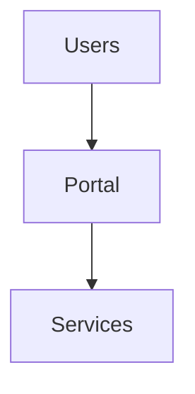

______________________________________________________________________

## Document Controls

| Field | Value |
| ----- | ----- |
| Authors | Platform Documentation Team |
| Version | 0.1-draft |
| Status | implementable |
| Classification | Confidential |
| Last updated | 2025-10-29 |
| Owners | Platform Documentation Team |
| Reviewers | Platform Architecture |
| Approvers | Architecture Steering Committee |
| Approved by |  |
| Approved date |  |

______________________________________________________________________

## Overview

Purpose: Canonical index of platform diagrams and where to find their owner documents. Sources live next to their owner docs under a local `diagrams/` folder. Cross‑cutting visuals are owned by the TDD overview and live under `overview/tdd/diagrams/`.

Contract: Do not store Mermaid sources in appendices. Embed diagrams in the owning document; consumer docs reference the owner’s built SVG and link back to the owner section.

Embedding recipe (owner doc):

Owner vs. consumer usage:

- Owner doc: Mermaid fence for site + PDF fallback SVG as above.
- Consumer docs: reference the owner’s built SVG and link to the owner section (no copies).

Selected canonical diagrams (TDD‑owned)

- System context: `overview/tdd/diagrams/system-context-v1.mmd` (Architecture Overview)
- Artifact lifecycle (WP/CD): `overview/tdd/diagrams/artifact-lifecycle-overview-v1.mmd`
- Data lineage: `overview/tdd/diagrams/data-lineage-v1.mmd`
- Signing and delivery: `services/digital-signer/diagrams/signing-delivery-v1.mmd`
- DR region failover: `overview/tdd/diagrams/dr-region-failover-v1.mmd`
- DSAR hard purge: `overview/tdd/diagrams/dsar-erasure-v1.mmd`

Service-owned diagrams (examples)

- Guardian: `services/guardian/diagrams/` — upload happy path, approval workflows, judgment class model, portal invalidation UX.
- LangGraph agents: `services/langgraph-agents/diagrams/` — analyze/compose pipeline, orchestration classes, shadow-mode flows.
- Localization & Policy Engine: `services/lp-engine/diagrams/` — residency policy enforcement, LLM failover orchestrator, FinOps deploy guard.
- Settings Registry: `services/settings/diagrams/` — activation state machine and class model.

Notes

- Path rule: `docs/src/<REL>.mmd` renders to `docs/src/build/mermaid/<REL>.svg`.
- Optional metadata in `.mmd` (not required):
  - `%% id: <slug>`
  - `%% version: v1`
  - `%% owner: <owner-doc>`
