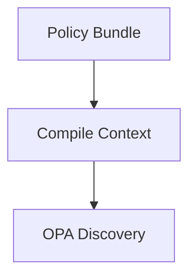

# Execution Plan: Modularizing Documentation & Standardizing Service Docs

This plan lays out a phased approach to refactor the uDocket documentation. We will break the monolithic **TDD** into a high-level overview document and individual specs for each service, app, and agent. Each component document will follow a universal structure (**Purpose, Contract, State, Failure, Observability,** etc.) based on our existing section preamble. We’ll also centralize shared information in appendices to eliminate duplication. Throughout the plan, we incorporate best practices from industry documentation (clear API contracts, data schema, observability metrics, runbooks, etc.) to ensure each doc is comprehensive but not redundant. We will update our docs build system (**MkDocs + Pandoc**) and CI as needed for the new layout, and include new diagrams (via **Mermaid**) at appropriate sections to illustrate key workflows.

**How to use this plan:** Each phase below can be handed off to an LLM agent (or team member) for execution. The phases are sized to be achievable in a few work cycles, without overwhelming context. We recommend completing them in order, as later phases depend on earlier restructuring.

---

## Phase 0: Groundwork – Structure & Standards (Day 1–2)

**Goal:** Establish the new documentation layout, filenames, and templates before moving any content. Prep the tooling (directory structure, config, CI) so subsequent content migration goes smoothly.

### 0. Principles

* **Single doc root, clear boundaries**
  * `docs/src/` = human-authored sources (Markdown, Mermaid, images, styles).
  * `docs/site/` and `docs/build/` = generated/temporary (gitignored).
  * **No PDFs committed**; publish PDFs as **GitHub Release assets** when you tag.
* * **One canonical home per topic** (service specs live under services/; shared truths live in appendices; `overview/tdd.md` stays high‑level and links out).
* * **Stable release mechanics**
* * CI always lints/builds site on PRs.
* * Release pipeline **only** runs on a tag (so it’s dormant until your first tag).

### 1. Set Up Version Control Context

* Create a new docs refactor branch, e.g. `docs/stack`, to isolate these changes.
* Take snapshots of current key docs (`overview/tdd.md`, any existing `services/*.md` or `apps/*.md`) for reference. This will help verify that content isn’t lost during moves.

### 2. Define New Directory Structure

Adopt a single “overview” namespace for strategy docs (TDD, PRD), and keep implementation docs (services/apps/ops/adr) as peers. Every document owns its diagrams under a local `diagrams/` folder; cross‑cutting visuals are owned by the TDD overview.

```tree
docs/                              ← single doc root
  src/                             ← SOURCE (committed)
    overview/
      index.md
      tdd.md                       ← canonical TDD document
      prd.md                       ← canonical PRD document (stub initially)
      tdd/
        index.md
        diagrams/                  ← cross‑cutting diagram sources owned by TDD
        appendices/
          glossary.md
          status-mapping.md
          diagrams.md              ← index page linking to canonical owner sections (no sources)
      prd/
        index.md
        diagrams/                  ← PRD‑owned diagram sources
    services/
      lp-engine.md
      lp-engine/diagrams/
      guardian.md
      guardian/diagrams/
      settings.md
      settings/diagrams/
      ref-manager.md
      ref-manager/diagrams/
      # ... other services with their own diagrams/
    apps/
      # app specs and each app’s diagrams/
    ops/
      runbooks/
    adr/
      adr-0001.md
      adr-0002.md
    assets/
      css/
        print.css                  ← used by Pandoc PDFs
  build/                           ← build cache (gitignored)
    html/
    pdf/
  releases/
  site/
  styles/vale/
  .vale.ini
  mkdocs.yml
scripts/
  docs/
    build_site.sh
    build_pdf_prd.sh
    build_pdf_tdd.sh
    render_mermaid.sh
```

**.gitignore** (excerpt)

```gitignore
/docs/site/
/docs/build/
/docs/src/**/.cache/
/docs/src/**/.pytest_cache/
```

> **Publish PDFs to GitHub Releases** on tagged versions and keep `docs/releases/manifest.json` in repo pointing to those assets (lighter repo history).

---

### 3. Establish a Standard Doc Template for Services/Apps

To ensure every service and app document covers all required information consistently, adopt a universal section structure.
Each service, app, or agent document will follow a shared, **standardized set of H2 (`##`) section headings**, which reflect its lifecycle and responsibilities (e.g., Purpose, API Contract, State Management, Failure Modes, Observability, etc.).

#### Phase 0 enforcement checklist

* Retrofit all existing service specs (`services/guardian.md`, `services/settings.md`, `services/lp-engine.md`, `services/ref-manager.md`, etc.) so their H2 hierarchy matches the canonical numbering (`0) Reading guide` … `10) References`) and every major section opens with the standardized preamble block (Purpose, Contract, State, Failure, Observability, References, Breadcrumbs).
* Normalize `## 8) Operational notes` to include the standard subsections (`### 8.1 Operational posture`, `### 8.2 Incident triggers`, `### 8.3 Runbooks & drills` with nested index/primary/cadence, `### 8.4 Migrations & backfills`, `### 8.5 Operational workflows`). Relocate legacy “Appendix R” content into those subsections and call out intentional omissions in-line when a subsection does not apply.
* Capture any missing sections, absent breadcrumbs, or deviations in a shared Phase 0 worksheet so we can resolve gaps before Phase 1 migrations.
* Treat Guardian as the first remediation target, then sweep remaining service specs once its structure is compliant.

#### Standardized H2 structure

To ensure every service and app document covers all required information consistently, adopt a universal section structure:

These **top-level sections** make every document familiar and navigable. Within each H2 section, teams can use **H3 (`###`) and H4 (`####`) as needed** to break down complex content (e.g., separate internal/external APIs).

```markdown
* `## 1) Purpose`: The role of the service/app in the platform. Why it exists and what high-level function it provides.
* `## 2) Responsibilities`: Lay out the scope of responsibility this component has.
* `## 3) API Contract`: Describe inputs and outputs (REST, events, files, etc.). Subdivide by public/internal APIs if needed: `### 3.1 External Interfaces`: Include endpoint tables, events, etc.; `### 3.2 Internal APIs`: Detail intra-service APIs, gRPC, queues, etc.
* `## 4) State Management`: Persistent storage, configuration, cache/state rules. Details on data the service maintains, important in-memory state, caches, and how data consistency is handled. Also includes status and state transitions. Subdivide as needed (e.g., ### 4.1 Datastore Schema; ### 4.2 Runtime Configuration).
* `## 5) Failure Modes`: How the service fails and recovers – error conditions, retry logic, what happens if dependencies are down, any circuit breaker or failover behavior. (Think in terms of both systemic failures and domain-specific failure cases.)
* `## 6) Observability`: What telemetry the service provides – health checks, metrics, logs, traces. Include key metrics (SLIs) it tracks (e.g. request throughput, error rates) and how one can detect if the service is unhealthy or encountering issues.
* `## 7) Security and Compliance`: Any key auth, data classification, encryption, regulatory rules, privacy laws, PII, SPI, PHI.
* `## 8) Operational Notes`: Cover deployments plus standardized subsections `### 8.1 Operational posture`, `### 8.2 Incident triggers`, `### 8.3 Runbooks & drills` (with nested index/primary/cadence), `### 8.4 Migrations & backfills`, `### 8.5 Operational workflows`—omit subsections only when they truly do not apply and call that out explicitly.
* `## 9) Dependencies`: Link to other services this interacts with (e.g., “depends on LLM Registry for model availability”).
* `## 10) References`: Links to ADRs, glossaries, diagrams, etc.
```

* Each H2 section may have nested H3/H4 as needed. Every major section (all H2s and most H3s) should open with the standardized preamble block (Purpose, Contract, State, Failure, Observability, References, Breadcrumbs) **except** `0) Reading guide`, which stays free-form orientation text.

#### Standardized section preamble

* The preamble is expected to be brief but as comprehensive as possible, with further details and clarifications in the sub-sections.
* Importantly, each major section should begin with a **section preamble block** using the defined fields:

* **Purpose:** Why does this section/topic exist?
* **Contract:** What are its boundaries or guarantees?
* **State:** What data, config or state transitions does it manage?
* **Failure modes & handling:** What can go wrong in this area and how do we handle it?
* **Observability:** How is it measured or monitored?
* **References:** What sections are referenced?
* **Breadcrumbs:** What files are directly associated with this section?

**Example:**

```markdown
**Purpose:** Provide the REST surface for reviewer actions without duplicating lifecycle logic.\
**Contract:** All approval paths defer to the ExclusiveSwap invariant in §5.4.1; this API performs validation, parameter handling, and audit fan-out only.\
**State transitions:** `approve` drives `QUEUED_FOR_REVIEW → APPROVED` and promotes the DL via §5.4.1; `changes` sets `CHANGES_REQUESTED`; `quarantine` routes through Guardian and lands in `QUARANTINED`. App.A.2 depicts the same transitions.\
**Failure modes & retries:** Stale versions raise `409 CONFLICT`, signer timeouts bubble as retryable errors, Guardian unavailability triggers Appendix B.1 manual mode, and portal invalidation runs idempotently.\
**Observability:** `reviews_api_requests_total`, `approval_swap_conflict_total`, `review_decision_latency_seconds`, audit events `REVIEW.APPROVED|CHANGES_REQUESTED|QUARANTINED`.\
**Breadcrumbs:** Implementation `apps/platform/api/reviews.py`, Tests `tests/platform/api/test_reviews.py::test_review_endpoints_require_exclusive_swap`, Observability Grafana “Reviews API” panel.\
**References:** §5.2.4–§5.2.6, §5.4.1, §7.1, App.A.2.
```

Prepare a template file (or simply a checklist) with these headings to use as a guide when refactoring each service/app. (E.g., create a `docs/src/services/_template.md` that lists the headings and brief instructions, purely for internal use.)

### 3.a Diagram Embedding (site + PDF)

Embed diagrams directly in the owning document. Use a Mermaid fence for the site render, followed by a PDF fallback that resolves during Pandoc builds.

Owner doc example (services/lp-engine.md):




Consumer docs (reuse by reference; no copies):

* Use the built SVG and link to the owner section:
  * `../../build/mermaid/services/lp-engine/diagrams/policy-context-flow.svg`
  * Source: services/lp-engine.md §X.Y

Path rule: if a source lives at `docs/src/<REL>.mmd`, the built SVG is at `docs/src/build/mermaid/<REL>.svg`. Embed using `/build/mermaid/<REL>.svg` so links stay valid from any document depth.

Optional metadata (first lines in `.mmd`):

```text
%% id: <slug>
%% version: v1
%% owner: <owner-doc>
```

### 4. Plan for Shared Content Centralization

Identify information that appears in multiple places or applies to the system as a whole, which should be documented once and referenced elsewhere. Common candidates include:

* **Guardian Status Definitions:** Map analysis outcomes (PASS/WARN/BLOCK) to final artifact statuses and define each one in an authoritative table (e.g., in `status-mapping.md`).
* **Artifact Lifecycle Overview:** A high-level description of how a user’s work product goes from draft to final deliverable through various stages (analysis, review, approval, signing, etc.). Present once (in the main TDD overview or an appendix) and reference from component docs.
* **Glossary of Terms:** A central glossary (`glossary.md`) for important terms like Artifact, Work Product, Deliverable, Residency Mode, Judgment, etc.
* **Architecture Diagrams:** Cross‑cutting visuals are owned by TDD overview; sources live under `overview/tdd/diagrams/`. Appendices provide an index page that links to the canonical sections; they do not store diagram sources by default.

### 5. Prep CI and Tooling Adjustments

Ensure the documentation toolchain is ready for the new structure:

* **MkDocs/Nav:** Update `mkdocs.yml` navigation to point to `overview/tdd.md`, `overview/tdd/*`, and `overview/prd/*` alongside `services/` and `apps/`.
* **Link Checking:** Anticipate broken links due to file moves and renames; set up redirects if desired via MkDocs plugins.
* **Docs lint:** Run `python scripts/docs/lint_docs.py` (optionally with per-file targets) after restructuring to validate references, appendices, and template scaffolding.
* **Vale Style Rules:** Update file path patterns; consider adding rules to enforce presence of the standard sections.
* **Pandoc/PDF build:** Update scripts/config to include `overview/tdd.md`, `overview/prd.md`, and any appendices.
* **Branch Protection/CI settings:** Run the docs CI (build, lint, link check) on this branch to catch issues early.

### 6. MkDocs config, plugins & PDF

`mkdocs.yml` (essentials you’ll likely want):

```yaml
site_name: uDocket Docs
repo_url: https://github.com/<org>/udocket.com
theme:
  name: material
  features:
    - navigation.sections
    - content.code.copy
markdown_extensions:
  - admonition
  - footnotes
  - toc:
      permalink: true
  - pymdownx.details
  - pymdownx.superfences          # enables Mermaid
  - pymdownx.tabbed
plugins:
  - search
  - tags
  - redirects
  - glightbox
  # For link checking in CI you can run an external tool instead of a plugin
nav:
  - Overview: index.md
  - TDD:
      - Overview: overview/tdd/index.md
      - Technical Design (High-Level): overview/tdd.md
      - Appendices:
          - Glossary: overview/tdd/appendices/glossary.md
          - Status Mapping: overview/tdd/appendices/status-mapping.md
          # optional index page that links to canonical sections (no sources)
          # - Diagrams Index: overview/tdd/appendices/diagrams.md
  - PRD:
      - Overview: overview/prd/index.md
      - Product Requirements: overview/prd.md
  - Services:
      - Guardian: services/guardian.md
      - Settings Registry: services/settings.md
      - LPE: services/lp-engine.md
      - Reference Manager: services/ref-manager.md
  - Apps:
      - Web App: apps/web-app.md
      - Worker Cluster: apps/worker-cluster.md
  - Ops:
      - Runbooks: ops/runbooks/
  - ADR: adr/
```

**Mermaid**: works via `pymdownx.superfences`. Keep `.mmd` sources under each document’s local `diagrams/` (e.g., `overview/tdd/diagrams/`, `services/<svc>/diagrams/`). Embed using fenced code blocks with `/build/mermaid/<REL>.svg` fallbacks so both site and PDF builds pick them up.

**PDF** options:

* **mkdocs-with-pdf** plugin (quickest). Good enough for many teams.
* **WeasyPrint**/Chrome print-to-PDF with a dedicated print stylesheet (`docs/src/assets/css/print.css`) for PRD/TDD pages.
* **Pandoc** pipeline for PRD/TDD only (best control over ToC, headers/footers). You can pipe Markdown → PDF with a template.

> In Markdown where you had ```mermaid fences, add a PDF-friendly image include right below as a fallback, e.g.:
>
> ````mermaid
> ```mermaid
> %% site render
> graph TD; A-->B;
> ```
> 
> ````
>
> The site shows the live Mermaid; Pandoc PDF uses the pre-rendered image (via `resource-path`).

---

### 7. Vale — “nicely configured” styles

**.vale.ini:**

````ini
StylesPath = styles/vale
MinAlertLevel = suggestion

Packages = Google, write-good

[*.md]
# General
BasedOnStyles = Google, write-good, uDocket-Core, uDocket-Policy

# Exclusions for code blocks & diagrams
BlockIgnores = (?s)```.*?```|::: mermaid.*?:::
# Optional: ignore headings from strict checks
TokenIgnores = ^#{1,6}\s
````

**styles/vale/uDocket-Core/Headings.yml:**

```yaml
extends: capitalization
message: "Use Sentence case for headings."
level: warning
scope: heading
match: '^[A-Z][a-z0-9].*'
```

**styles/vale/uDocket-Core/Terms.yml:**

```yaml
extends: existence
message: "Use the canonical term: '%s'."
level: suggestion
scope: text
ignorecase: false
nonword: true
tokens:
  - 'Artifact'        # preferred; flag 'artifact' when meant as a defined term
  - 'Work Product'
  - 'Candidate Deliverable'
  - 'Guardian'
  - 'Localization & Policy Engine'
exceptions:
  - 'artifact'        # allow lowercase when used generically
```

**styles/vale/uDocket-Policy/BindingLabels.yml:**

```yaml
extends: existence
message: "Label policy statements with (binding), (normative), or (informative)."
level: warning
scope: paragraph
ignorecase: true
# Require at least one policy label in sections mentioning policy/enforcement
tokens:
  - '\(binding\)'
  - '\(normative\)'
  - '\(informative\)'
# Only trigger inside policy-related files or headings
# (optional: use a 'scope' filter by path via Vale's CLI per-file config)
```

**styles/vale/uDocket-Policy/Citations.yml:**

```yaml
extends: substitution
message: "Use cross-ref format: TDD §X.Y, Service §N.M, App.<letter>."
level: suggestion
ignorecase: true
swap:
  'Section [0-9]+\.[0-9]+': 'TDD §$0'
```

> This combo gives you: consistent heading style, canonical term nudges, policy labeling reminders, and cross-ref hygiene.

---

### 8. CI workflow (GitHub Actions)

**On every PR and main:**

* Lint MD (`markdownlint`), style (`vale` optional), link check (lychee).
* Build MkDocs HTML to `docs/site/` (not committed).
* Validate Mermaid (fail on syntax errors).

**On tag (e.g., `docs-v0.8.0`):**

* Build HTML, upload to Pages (or artifact).
* Build PDFs (PRD/TDD).
* Generate `docs/releases/<YYYY-MM-DD>/manifest.json` with `{ file, sha256, signed_by, created_at }`.
* Sign PDFs (if you have your Digital Signer), produce `.sig`.
  Upload PDFs as **GitHub Release assets** and update `manifest.json` in repo to reference them.

#### 8.1 CI (PRs + main) — lint, build, validate (no releases yet)

`.github/workflows/docs-ci.yml`

```yaml
name: Docs CI
on:
  pull_request:
  push:
    branches: [ main ]

jobs:
  lint:
    runs-on: ubuntu-latest
    steps:
      - uses: actions/checkout@v4
      - uses: actions/setup-node@v4
        with: { node-version: 20 }
      - uses: actions/setup-python@v5
        with: { python-version: '3.11' }
      - name: Install tools
        run: |
          pip install markdownlint-cli2==0.12.0
          pip install vale==3.7.1
          npm i -g @mermaid-js/mermaid-cli
          pip install mkdocs mkdocs-material
          pip install pandocfilters
          sudo apt-get update && sudo apt-get install -y pandoc
      - name: Markdownlint
        run: npx markdownlint-cli2 '**/*.md' '#node_modules'
      - name: Vale
        run: vale docs/src/
      - name: Mermaid pre-render (validate diagrams)
        run: bash scripts/docs/prerender_mermaid.sh
      - name: MkDocs build (HTML)
        run: mkdocs build --clean
      - name: Pandoc dry-run (PRD/TDD only)
        run: |
          mkdir -p docs/build/pdf
          bash scripts/docs/build_pdf_prd.sh
          bash scripts/docs/build_pdf_tdd.sh

  linkcheck:
    runs-on: ubuntu-latest
    steps:
      - uses: actions/checkout@v4
      - name: Lychee link checker
        uses: lycheeverse/lychee-action@v2
        with:
          args: --verbose --no-progress 'docs/src/**/*.md' --exclude-mail
```

> This CI proves your docs build on every PR/main, but **does not publish**.

#### 8.2 Docs Release (only on tag) — build PDFs + upload to GitHub Release

`.github/workflows/docs-release.yml`

```yaml
name: Docs Release
on:
  push:
    tags:
      - 'v*'           # only runs when you cut your first version tag
      # or use: 'docs-v*' if you want doc-only versioning

jobs:
  build-and-release:
    runs-on: ubuntu-latest
    permissions:
      contents: write    # required to create GitHub Release and upload assets
    steps:
      - uses: actions/checkout@v4
        with:
          fetch-depth: 0
      - uses: actions/setup-node@v4
        with: { node-version: 20 }
      - uses: actions/setup-python@v5
        with: { python-version: '3.11' }
      - name: Install tools
        run: |
          npm i -g @mermaid-js/mermaid-cli
          pip install mkdocs mkdocs-material
          sudo apt-get update && sudo apt-get install -y pandoc
      - name: Build site
        run: mkdocs build --clean
      - name: Pre-render Mermaid
        run: bash scripts/docs/prerender_mermaid.sh
      - name: Build PDFs (PRD/TDD)
        run: |
          mkdir -p docs/build/pdf
          bash scripts/docs/build_pdf_prd.sh
          bash scripts/docs/build_pdf_tdd.sh
      - name: Checksums & manifest
        run: bash scripts/docs/hash_and_manifest.sh
      - name: Create GitHub Release
        id: create_release
        uses: softprops/action-gh-release@v2
        with:
          generate_release_notes: true
      - name: Upload PDFs
        uses: softprops/action-gh-release@v2
        with:
          files: |
            docs/build/pdf/prd.pdf
            docs/build/pdf/tdd.pdf
            docs/build/pdf/manifest.json
```

**Key point:** This pipeline **does nothing** until you push `vX.Y.Z`. That satisfies “doc releases won’t start until the first release is ready.”

> For when we want to publish the HTML site to GitHub Pages, add a separate workflow (or a job here) that deploys `site/` to `gh-pages` on tags or on `main`—your choice.

---

### 9. How this maps to your refactor

* TDD now lives under `docs/src/overview/tdd/` with:
  * Entry page `docs/src/overview/tdd.md` (high-level) and
  * Canonical spec `docs/src/overview/tdd.md`.
  * Appendices at `docs/src/overview/tdd/appendices/` (glossary, status mapping, etc.).
* PRD now lives under `docs/src/overview/prd/` with `docs/src/overview/prd.md` and `docs/src/overview/prd/index.md`.
* Move OPA content into `docs/src/services/lp-engine.md` under “Policy Agent (OPA) Integration”.
* Runbooks/ops remain under `docs/src/ops/runbooks/`.
* Diagram ownership:
  * Cross‑cutting diagrams are owned by TDD and live under `docs/src/overview/tdd/diagrams/`.
  * Service/app diagrams live under each doc’s local `diagrams/`.
  * Appendices provide an optional “Diagrams Index” page that links to canonical owner sections; they do not store sources.

---

### 10. Step-by-step rollout (adjusted)

1. **Create structure & config**

    * Create `docs/src/overview/` with `tdd/` and `prd/` subfolders as above.
    * Ensure `mkdocs.yml`, `.markdownlint.json`, optional `.vale.ini` exist.
    * Ensure `.gitignore` includes `docs/build/` and `docs/site/`.

2. **Migrate content**

    * Move existing TDD content to `docs/src/overview/tdd/`:
      * High-level entry: `docs/src/overview/tdd.md`
      * Canonical spec: `docs/src/overview/tdd.md`
      * Appendices: `docs/src/overview/tdd/appendices/*.md`
      * Cross‑cutting diagrams: `docs/src/overview/tdd/diagrams/*.mmd`
    * Move PRD content to `docs/src/overview/prd/` (add `index.md` and `prd.md`).
    * Keep service/app specs under `docs/src/services/` and `docs/src/apps/`; each has its own `diagrams/` folder.

3. **Cross-link cleanup**

    * Replace repeated tables with links to the canonical appendix.
    * Replace any OPA mentions in TDD with a link to `services/lp-engine.md#opa-integration`.
    * Ensure link paths match `mkdocs.yml` nav.

4. **Build & verify locally**

    * `scripts/docs/render_mermaid.sh` → render diagrams to SVG/PNG
    * `scripts/docs/build_site.sh` → mkdocs build
    * `scripts/docs/build_pdf_tdd.sh` → generate TDD PDF
    * Fix lint/link/Mermaid errors.

5. **CI**

    * Add GH Actions workflow for lint/build/check.
    * Add release workflow to build PDFs and publish (commit to `docs/releases/` *or* attach to GitHub Release).

6. **Governance**

    * Add `docs/CONTRIBUTING-docs.md` (how to add a service doc, how to reference appendices).
    * Add `CODEOWNERS` entries for PRD, TDD, each service doc.
    * Add a “canonical source” banner to each service page.

---

### 11. Practical policies (to keep you from hating this later)

* **No duplication:** If it’s shared (status mapping, lifecycle overview, glossary), it lives in appendices and is only linked elsewhere.
* **Immutable releases:** Snapshots (PDFs + manifest + checksums) live in `docs/releases/<date>/` or as GitHub Release assets. Use content-addressed names (include SHA-256) and sign them.
* **One doc per service.** API contracts, states, failure modes, observability, security—keep them in the service page and link from TDD.
* **“Binding / Normative / Informative” labels** for policy/legal bits to remove ambiguity.
* **Diagrams are first-class.** Keep `.mmd` sources under version control; render to HTML at build time; only export PNG/SVG when you truly need embeds (and keep the source next to it).

### 12. Quality & Governance

* **Vale** runs on every PR — keeps voice/terms consistent and policy sections labeled.
* **CODEOWNERS** for PRD/TDD/services ensures the right SMEs approve changes.
* **No duplication**: if two pages need the same content (e.g., Guardian mapping), it lives in **Appendices**; other pages link to it.
* **ADR index**: keep ADRs in `docs/src/adr/` and link from TDD/PRD where decisions are referenced.

---

### 13. Niceties

* Add a **“Docs: How To”**: `docs/CONTRIBUTING-docs.md` with short recipes (add a diagram, add a service page, add a policy label, how to cut a release).
* Add **print.css** refinements for Pandoc (page breaks before H1/H2, better code wrapping, smaller margins for tables).

**Deliverables for Phase 0:** A clear project scaffold ready for content migration; site builds with new structure.

---

## Phase 1: Isolate OPA/Policy Engine Content into LPE Doc (0.5 day)

**Goal:** Remove deeply technical OPA (Open Policy Agent) details from the overview and place them in the **LPE (Localization & Policy Engine)** service document.

### 1. Extract OPA Integration Details

* Locate all OPA usage details in the monolithic TDD and cut them from the overview.

### 2. Create a “Policy Agent Integration” section in `lp-engine.md`

* Add a dedicated subsection for Policy Enforcement (OPA) and paste/refine content there.
* Ensure context is LPE-centric, including security, performance, and observability details.

### 3. Insert a Summary & Pointer in the TDD Overview

* Replace removed content with a concise summary and link to LPE’s detailed section.

### 4. Update References to OPA Elsewhere

* Update mentions in other docs (Guardian, Settings, etc.) to point to LPE’s section.

### 5. Quality Check

* Verify overview reads cleanly; LPE doc is coherent and self-contained; links work.

**Deliverables for Phase 1:** `overview/tdd.md` trimmed and linked; `lp-engine.md` contains comprehensive OPA integration.

---

## Phase 2: Modularize All Services, Apps, and Agents (2–4 days)

**Goal:** Carve remaining monolithic TDD content into individual service and app documents, following the standard structure.

**Target components:**

* **Services:** Guardian, Digital Signer, Settings Registry, LLM Registry, LPE, Reference Manager, Notifications, LangGraph Agents.
* **Apps:** Web App, Worker Cluster.

**For each component:**

1. **Create or Update the Component Doc File**
    * Ensure file exists under `services/` or `apps/` with standard headings.
    * Add a brief banner noting it is the canonical design spec.
2. **Extract Content from `overview/tdd.md`**
    * Move details into appropriate sections (**Purpose, Contract, State, Failure Modes, Observability**).
    * Convert prose API descriptions to clear lists/tables where possible.
3. **Move Existing Diagrams**
    * Relocate component-specific `.mmd` files from `overview/tdd/diagrams/` (or other shared locations) into the doc’s local `diagrams/` folder.
    * Update Mermaid embeds and PDF fallbacks to reference `../../build/mermaid/<owner>/diagrams/<name>.svg`.
4. **LangGraph Agents**
    * Create `langgraph-agents.md`; describe how agents orchestrate LLMs, how they coordinate with LLM Registry or Workers, etc.
5. **Ensure Nothing is Lost**
    * Compare before/after; cross off migrated sections using the Phase 0 snapshot checklist.
6. **Fill Gaps**
    * Add missing details (health checks, key metrics) or leave clear TODOs.
7. **Minimize Main TDD to Summaries**
    * Replace detailed sections with 3–5 sentence summaries + links.
8. **Adjust Cross-References**
    * Cross-link related docs; describe inter-component interactions from both sides.
9. **Move Shared Content to Appendices**
    * Centralize shared tables/definitions; link from component docs.
10. **Review Each New Document for Structure**
    * Ensure all core sections are present and non-empty; tone is consistent.
11. **Commit Incrementally**
    * Commit after each component to enable parallel review and easy rollback.

**Deliverables for Phase 2:** All component docs populated; main `overview/tdd.md` reduced to high-level summaries with links.

---

## Phase 3: Deduplicate and Centralize Shared Information (1 day)

**Goal:** Remove repetition and create authoritative appendices for shared content. Clean up inconsistencies introduced in the split.

1. Finalize Appendices
    * **Glossary:** Consolidate definitions (Artifact, Work Product, Deliverable, Residency Mode, etc.).
    * **Status Mapping:** Centralize Guardian analysis outcomes to artifact status table with definitions.
    * **Global Workflows:** Write “Artifact Lifecycle” appendix (with diagram in Phase 4).
2. Replace Duplicates with References
    * Remove redundant definitions in component docs and replace with links to appendices.
3. Normalize Cross-Referencing Style
    * Use consistent link text and section references across docs.
4. Documentation Style Consistency Pass
    * Unify terminology, tone, tense; ensure core sections are present and filled.
5. Run the Site Build & Tests
    * Verify navigation and links; fix any broken references.

**Deliverables for Phase 3:** No duplicated content; appendices populated; cohesive, consistent docs with working cross-links.

---

## Phase 4: Incorporate Diagrams for Clarity (1–2 days)

**Goal:** Add high-value diagrams to illustrate complex interactions and workflows using **Mermaid**; embed with contextual text.

### 1. Planned Diagrams & Placement

1. **System Context Diagram (C4-ish)** — in `overview/tdd.md` (Architecture Overview).
2. **Artifact Lifecycle Overview** — in main TDD or Appendix (referenced widely).
3. **Analysis Workflow (Guardian)** — in `guardian.md` under analysis logic.
4. **Approval/Signing & Delivery** — in `signer.md` (covers approval→signing→delivery, with Notifications).
5. **Residency & Policy Enforcement Sequence** — in `lp-engine.md` (OPA in action).
6. **LLM Orchestration Failover** — in `langgraph-agents.md` (or `llm-registry.md`), showing model failover.

### 2. Diagram Creation Process

1. Store Mermaid sources under `docs/src/overview/tdd/diagrams/` (e.g., `system-context.mmd`, `artifact-lifecycle.mmd`, etc.).
2. Embed via Mermaid code blocks or pre-render for PDFs as needed.
3. Add captions and brief explanatory text around each diagram.

### 3. Verify Diagram Rendering

1. Build locally/CI to catch syntax/layout issues; split complex diagrams if needed.

**Deliverables for Phase 4:** Diagrams created, embedded, and rendering; single authoritative locations with links from other docs.

---

## Phase 5: Address Compliance, Security, and Policy Clarity (0.5 day)

**Goal:** Make policy/compliance statements explicit and unambiguous; add examples where helpful.

1. Label Policy Statements
   * Use labels: **(binding)**, **(normative)**, **(informative)** for clarity in Guardian/LPE docs.
2. Add Examples for Complex Rules
   * Provide concrete scenarios (e.g., PHI access blocked by policy when out-of-region).
3. Security & Compliance Sections
   * Ensure sections or callouts exist in services that have obligations (Signer audit logs, Guardian quarantine retention, etc.).
4. Review with a Compliance Mindset
   * Tie statements back to PRD requirements where applicable.
5. Consistency in Policy Terminology
   * Ensure terms like **PHI**, **HIPAA Mode**, **data residency** are defined in the glossary.

**Deliverables for Phase 5:** Clear, labeled policy statements with examples; compliance-relevant sections are explicit and consistent.

---

## Phase 6: Update CI, Validation, and Contributor Guidelines (0.5–1 day)

**Goal:** Finalize toolchain for continuous support of the new structure; update contributor docs.

1. Adapt CI Configuration
    * **MkDocs Build:** Confirm paths/naming.
    * **Link Checker:** Re-run and fix issues; configure redirects if used.
    * **Mermaid Diagrams:** Pre-render for PDFs if required; include in CI.
    * **Pandoc PDF Generation:** Update inputs for new overview/appendices.
    * **Markdown Lint & Vale:** Update rules/paths; consider rule to enforce core sections.

2. Documentation for Docs (Contributor Guide)
    * Explain structure under `docs/src/overview/tdd/` and the standard sections.
    * Encourage centralization via appendices; outline diagram process.
    * Note style rules (Vale), policy labels, and relative linking conventions.

3. CODEOWNERS and Review Process
    * Assign owners per doc; ensure auto-review requests on changes.
    * (Optional) Dry-run a “new service” addition to validate the process.

**Deliverables for Phase 6:** Passing CI; contributor guide updated; owners designated.

---

## Phase 7: Final Review, PRs, and Release Preparation (1–2 days)

**Goal:** Merge changes into main via themed PRs; prepare first documentation release.

1. Split into Themed Pull Requests
    * **PR 1:** Base Structure & OPA Move.
    * **PR 2:** Core Services Modularization (Guardian, Signer, LPE).
    * **PR 3:** Remaining Services & Apps (including LangGraph Agents).
    * **PR 4:** Appendices & Deduplication.
    * **PR 5:** Diagrams.
    * **PR 6:** CI & Docs Tooling.
    * **PR 7 (Optional):** Cleanup & Minor Fixes.
2. Conduct Reviews and Team Sign-off
    * Assign reviewers; attach rendered diagram images in PRs if helpful.
3. Merge and Tag
    * Tag e.g., `docs-v1.0.0`; verify CI-produced artifacts (PDFs/releases).
4. Post-merge Cleanup
    * Remove obsolete files/links; update README/wiki links accordingly.
5. Announce the Changes
    * Share the new structure, locations, and contributor guide internally.

**Deliverables for Phase 7:** All changes merged; version-tagged release created; team informed.

---

## Phase 8: (Ongoing) Maintenance and Future Enhancements – Post-project

**Maintenance of Diagrams:** Update alongside architecture/code changes.

**Periodic Audits:** Treat service docs as part of the code; update with new APIs.

**New Services/Features:** Use the template to add new docs consistently.

**Versioning (if needed):** Plan for archiving/versioning docs as product versions evolve.

**Feedback Loop:** Refine docs based on developer/onboarding/LLM usage feedback.

---

## Summary Checklist of Key Actions

### Project Setup

* [x] Branch `docs/stack` created.
* [x] New `docs/src/overview/tdd/` directory structure in place (with `overview/tdd.md`, appendices, diagrams).
* [x] MkDocs nav updated for new structure.
* [x] Standard section template prepared for service/app docs.
* [x] Initial CI config adjustments sketched out (paths, file names).

### Phase 1 (OPA move)

* [x] OPA details cut from main TDD and added to LPE doc.
* [x] Summary placeholder added in main TDD with link to LPE.
* [x] All references to OPA/policy updated to point to LPE doc.

### Phase 2 (Modularization per component) — repeat for each service/app/agent

* [x] Guardian: content moved, sections filled, TDD summary added.
* [x] Digital Signer: content moved, sections filled, TDD summary added.
* [x] Settings Registry: moved & filled, summary.
* [x] LLM Registry: moved & filled, summary.
* [x] LPE: remaining content moved if any; summary.
* [x] Reference Manager: moved & filled, summary.
* [x] Notifications: moved & filled, summary.
* [x] Web App: moved & filled, summary.
* [ ] Worker Cluster: moved & filled, summary.
* [ ] LangGraph Agents: moved and filled; summary in TDD.
* [ ] Each new doc has the **Purpose/Contract/State/Failure/Observability** structure clearly in place.
* [ ] Main `overview/tdd.md` now only has high-level descriptions + links.

### Phase 3 (Dedup & centralize)

* [ ] `glossary.md` created and populated with key terms.
* [ ] `status-mapping.md` created with correct status/judgment table.
* [ ] Other appendix pages (e.g., “Workflow Details”) created and filled.
* [ ] Removed duplicated definitions/tables; replaced with links to appendices.
* [ ] Docs cross-referencing consistently; global link check passes.

### Phase 4 (Diagrams)

* [ ] `system-context.mmd` created.
* [ ] `artifact-lifecycle.mmd` created.
* [ ] `guardian-analysis.mmd` created.
* [ ] `signing-delivery.mmd` created.
* [ ] `policy-sequence.mmd` created.
* [ ] `llm-failover.mmd` created.
* [ ] Each diagram embedded in the appropriate doc with explanatory text.
* [ ] Verified all diagrams render in HTML/PDF.

### Phase 5 (Compliance clarity)

* [ ] (binding/normative/informative) labels added where appropriate.
* [ ] Examples added for key policy scenarios.
* [ ] Security/Compliance subsections in relevant docs.
* [ ] Glossary updated for compliance terms.
* [ ] SME/second-party review completed.

### Phase 6 (CI and guide)

* [ ] CI pipeline updated (markdown lint, Vale, MkDocs, Mermaid, Pandoc).
* [ ] All CI checks passing on the branch.
* [ ] Contributor guide updated with structure/standards.
* [ ] CODEOWNERS updated for new doc files.
* [ ] MkDocs redirects configured (if desired).

### Phase 7 (PRs & release)

* [ ] Themed PRs prepared, reviewed, and merged.
* [ ] Tag created (e.g., `docs-v1.0`); release workflow run.
* [ ] PDF artifacts generated/uploaded; site reflects new content.
* [ ] Obsolete files/folders removed.
* [ ] Team notified with summary and links.

By following this phased plan, the transition to a modular, maintainable documentation set will be smooth and thorough. Each phase produces tangible improvements while ensuring we preserve the knowledge from the original documents. The end result: a documentation system that is easier to navigate, update, and trust — for both human developers and LLM agents.
